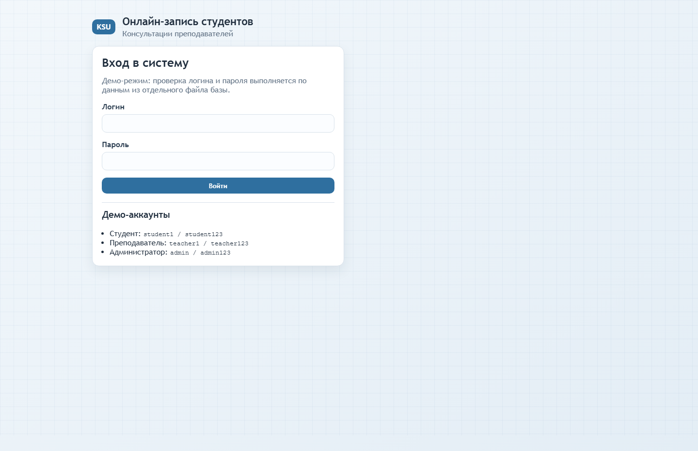
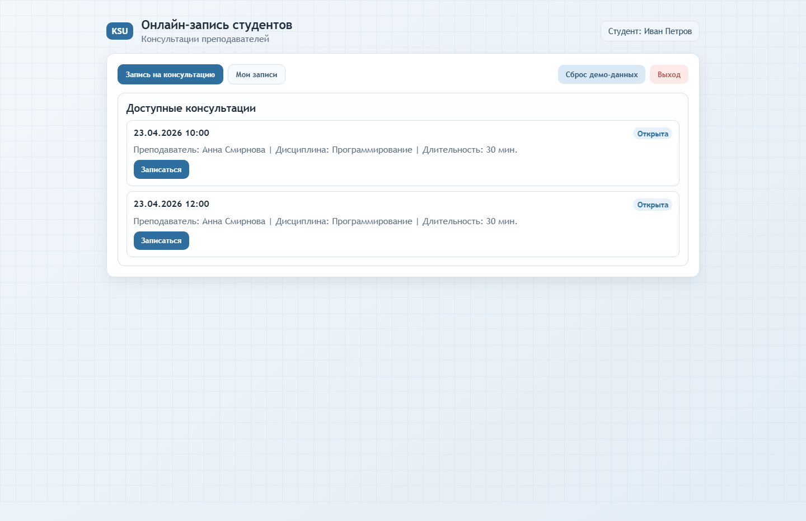
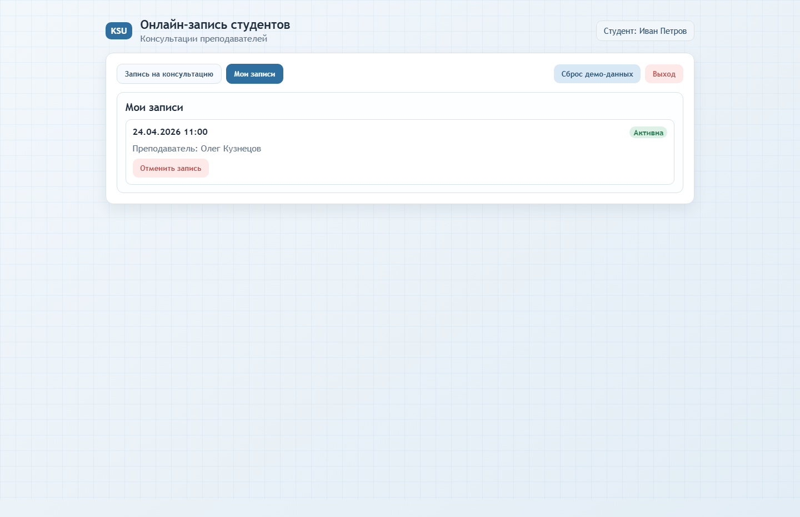
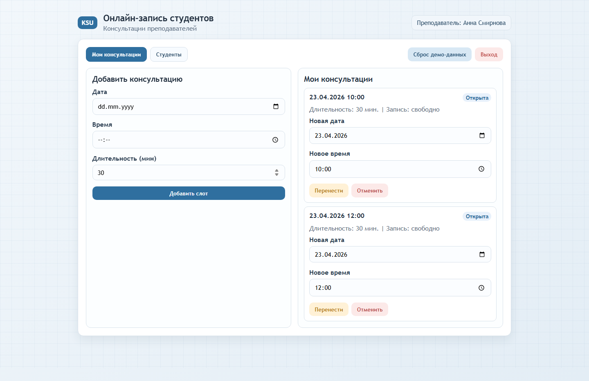
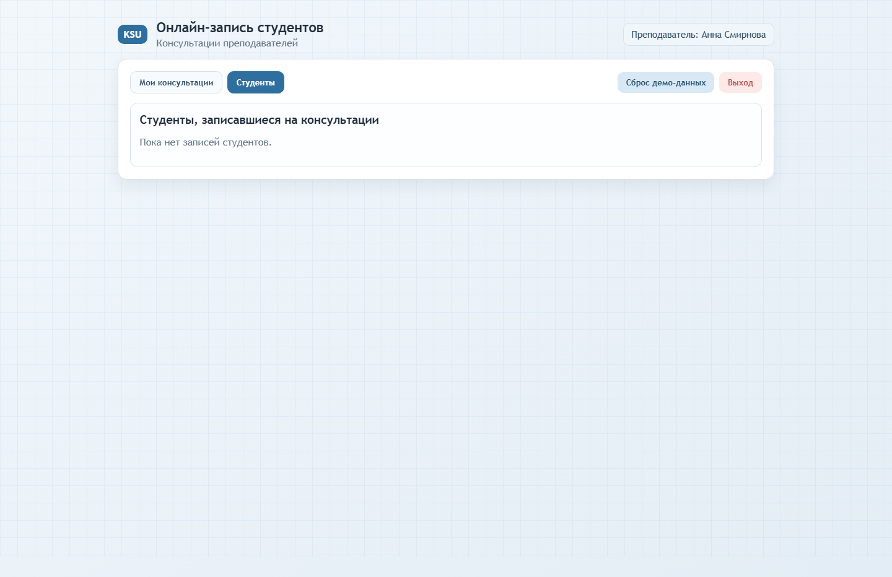
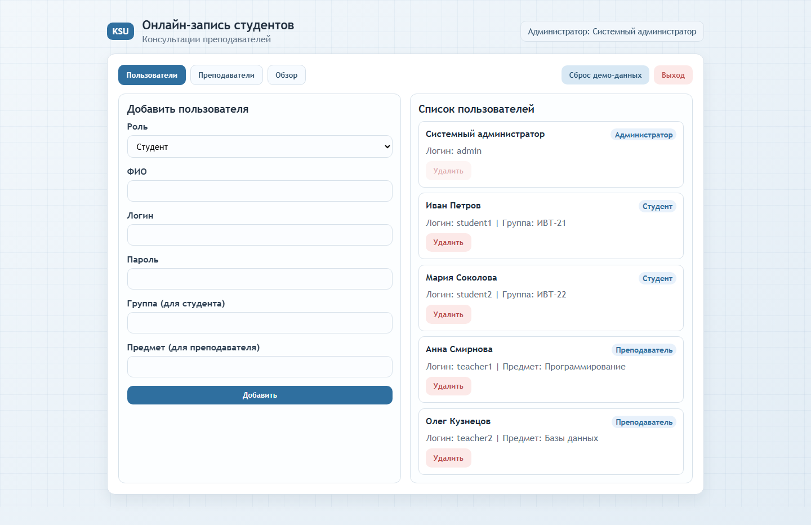
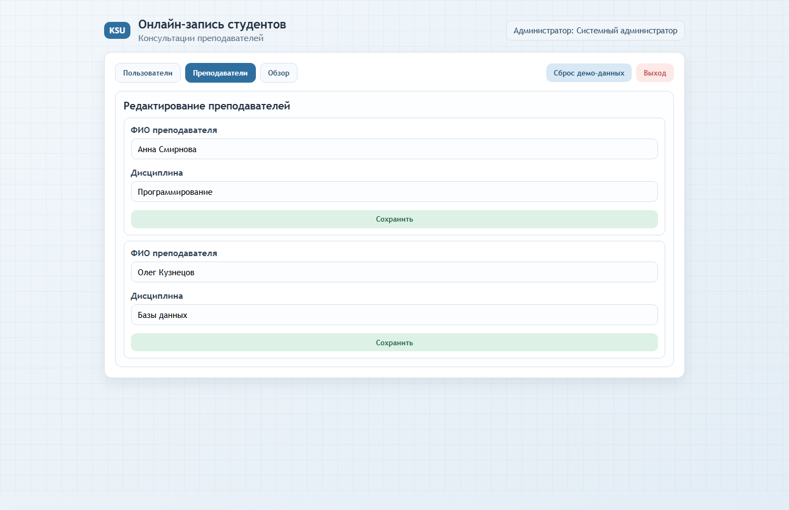
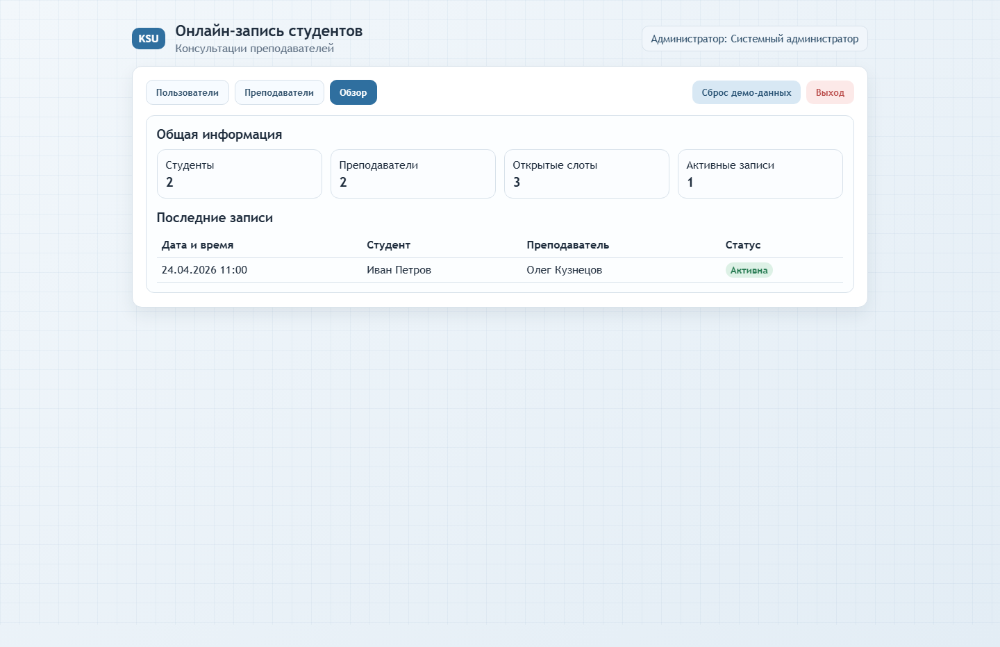

# Система онлайн-записи студентов на консультации

Демо-веб-приложение для учебного задания: запись студентов на консультации к преподавателям с разделением прав по ролям.

## Визуально: как выглядит сайт

### Экран входа



### Личный кабинет студента

Запись на свободные консультации:



Мои записи и отмена:



### Личный кабинет преподавателя

Управление слотами консультаций (добавить, перенести, отменить):



Список записавшихся студентов:



### Панель администратора

Управление пользователями:



Редактирование преподавателей:



Общая сводка по системе:



## Как это работает

1. При запуске сайт загружает демо-базу из отдельного файла `data/demo-db.json`.
2. Пользователь вводит логин и пароль, система проверяет их по данным из базы.
3. После входа открывается кабинет по роли:
   - `student`: запись на консультации, отмена, просмотр своих записей;
   - `teacher`: создание/перенос/отмена слотов, просмотр студентов;
   - `admin`: управление пользователями, преподавателями и расписанием.
4. Все изменения сохраняются в `localStorage` (для демо), есть кнопка сброса к исходной базе.

## Соответствие ТЗ и реализации

| Пункт ТЗ | Как реализовано в проекте |
|---|---|
| Авторизация пользователей | Вход по логину/паролю с проверкой из `data/demo-db.json` |
| Роли (студент/преподаватель/админ) | Реализованы отдельные вкладки и действия по каждой роли |
| Запись студентов на консультации | Студент видит свободные слоты и может записаться |
| Отмена записей | Студент может отменить свою запись |
| Управление консультациями преподавателем | Преподаватель может добавлять, переносить и отменять слоты |
| Список записавшихся | У преподавателя отдельный экран с бронированиями студентов |
| Администрирование | Админ добавляет/удаляет пользователей, редактирует преподавателей, видит общую статистику |
| Адаптивный и понятный интерфейс | Минималистичный UI, адаптация под разные размеры экрана |
| Сохранение данных | Демо-состояние сохраняется в `localStorage` |

## Техническое задание (исходный текст)

# 🚀 ТЕХНИЧЕСКОЕ ЗАДАНИЕ
## Сайт онлайн-записи студентов на консультации

---

## 1. Наименование документа
Техническое задание на разработку веб-сайта
«Система онлайн-записи студентов на консультации к преподавателям»

---

## 2. Основание для разработки
Учебное задание по дисциплине
«Стандартизация, сертификация и техническое документоведение»

---

## 3. Назначение сайта
Сайт предназначен для организации онлайн-записи студентов
на консультации к преподавателям через интернет.

---

## 4. Цель создания сайта
Автоматизация процесса записи студентов и управления расписанием консультаций.

---

## 5. Краткая характеристика системы

Система представляет собой веб-приложение.

Пользователи системы:
- студент;
- преподаватель;
- администратор.

---

## 6. Требования к функциям системы

### 6.1 Студент должен иметь возможность:
- войти в систему;
- выбрать преподавателя;
- посмотреть доступное время консультаций;
- записаться на консультацию;
- отменить запись;
- просмотреть свои записи.

### 6.2 Преподаватель должен иметь возможность:
- войти в систему;
- установить дни и время консультаций;
- просматривать список записавшихся студентов;
- отменять или переносить консультации.

### 6.3 Администратор должен иметь возможность:
- добавлять и удалять пользователей;
- редактировать данные преподавателей;
- контролировать расписание консультаций;
- просматривать общую информацию по записям.

---

## 7. Требования к пользователям

Студент:
- наличие учетной записи;
- базовые навыки работы с ПК.

Преподаватель:
- учетная запись;
- навыки работы с системой.

Администратор:
- доступ к панели управления;
- навыки администрирования.

---

## 8. Требования к интерфейсу
- простой и понятный интерфейс;
- адаптивный дизайн;
- наличие меню навигации;
- личный кабинет пользователя;
- формы записи и управления расписанием.

---

## 9. Требования к надежности и безопасности
- авторизация пользователей;
- защита данных;
- разграничение прав доступа;
- резервное копирование;
- защита от несанкционированного доступа.

---

## 10. Требования к результату работы сайта
- корректная работа в браузерах;
- возможность записи на консультации;
- сохранение данных;
- стабильная работа системы.

---

## 11. Заключение
Данное техническое задание является основой для разработки веб-сайта
онлайн-записи студентов на консультации.

## Запуск проекта

```bash
python -m http.server 5500
```

Открыть в браузере: `http://localhost:5500`

## Демо-аккаунты

- Студент: `student1` / `student123`
- Преподаватель: `teacher1` / `teacher123`
- Администратор: `admin` / `admin123`

## Структура проекта

- `index.html` - разметка интерфейса.
- `styles.css` - стили (минималистичная образовательная тема).
- `app.js` - логика приложения, роли и действия.
- `data/demo-db.json` - отдельный файл демо-базы.
- `docs/screenshots/` - скриншоты для презентации проекта.

## Важно

Это учебный демо-проект. Пароли хранятся в открытом JSON и не подходят для production.
